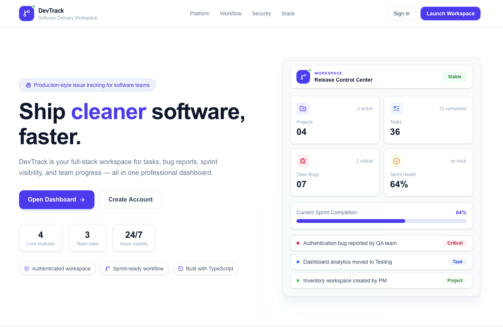

### DevTrack Landing Page


# DevTrack — Developer Task & Bug Tracking System

DevTrack is a production-style full-stack software delivery workspace for managing projects, development tasks, bug reports, sprint progress, and issue resolution.

It is built as a portfolio-grade project using Next.js, TypeScript, Supabase Auth, PostgreSQL, API route handlers, and a modern light SaaS dashboard UI.

## Features

- Production-style landing page
- Supabase authentication
- User profile roles: project manager, developer, tester
- Project workspace CRUD
- Task board with status updates
- Bug reporting and severity tracking
- Dashboard/report API stats
- Activity log backend structure
- API route handlers for projects, tasks, bugs, activity, and reports
- Responsive light admin interface

## Tech Stack

| Area | Technology |
|---|---|
| Frontend | Next.js, TypeScript |
| Styling | Tailwind CSS |
| Backend Routes | Next.js Route Handlers |
| Auth | Supabase Auth |
| Database | Supabase PostgreSQL |
| API Client | Custom `lib/api.ts` helper |
| Icons | Lucide React |
| Deployment | Vercel |

## Folder Structure

```text
devtrack/
├── app/
│   ├── api/
│   ├── dashboard/
│   ├── login/
│   ├── register/
│   ├── projects/
│   ├── tasks/
│   ├── bugs/
│   ├── reports/
│   └── profile/
├── components/
├── docs/
├── lib/
├── supabase/
└── README.md
```

## Setup

### 1. Install dependencies

```bash
npm install
```

### 2. Create `.env.local`

```env
NEXT_PUBLIC_SUPABASE_URL=https://your-project-ref.supabase.co
NEXT_PUBLIC_SUPABASE_ANON_KEY=your-supabase-anon-key
```

Do not include `/rest/v1/` in the Supabase URL.

### 3. Create database tables

Open Supabase SQL Editor and run:

```text
supabase/schema.sql
```

### 4. Disable email confirmation for local testing

Supabase → Authentication → Providers → Email → Confirm email OFF.

### 5. Run project

```bash
npm run dev
```

Open:

```text
http://localhost:3000
```

## Main Routes

| Route | Purpose |
|---|---|
| `/` | Landing page |
| `/login` | Login |
| `/register` | Register |
| `/dashboard` | Dashboard UI |
| `/projects` | Project CRUD |
| `/tasks` | Task board CRUD |
| `/bugs` | Bug tracker CRUD |
| `/reports` | Backend stats report |
| `/profile` | User profile |
| `/test-supabase` | Supabase connection test |

## API Routes

See `docs/API_WORKFLOWS.md`.

## Database

See `docs/DATABASE_SCHEMA.md` and `supabase/schema.sql`.

## Sample Data

Optional sample data is available in:

```text
supabase/seed.sql
```

Run it in Supabase SQL Editor after `schema.sql` if you want demo rows.

## Deployment

See `docs/DEPLOYMENT.md`.

## Testing

See `docs/TESTING.md`.

## Portfolio Description

DevTrack is a full-stack developer task and bug tracking system built with Next.js, TypeScript, Supabase, and PostgreSQL. It simulates a real software delivery workspace where teams can manage projects, assign tasks, report defects, classify severity, and track sprint progress using a production-style dashboard.
